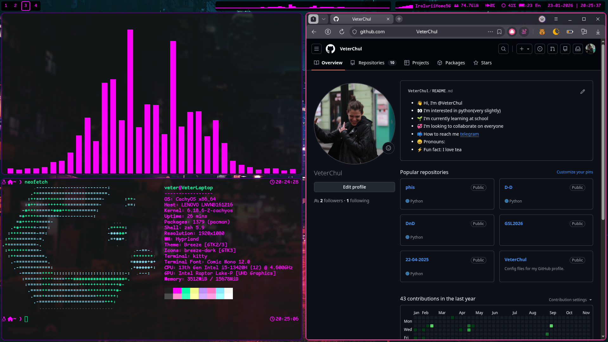
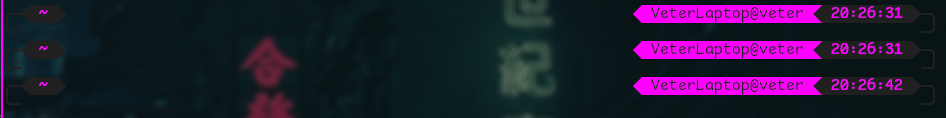
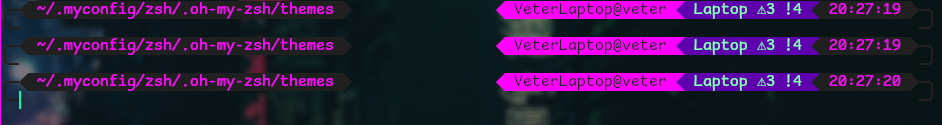

# Мой .myconfig

## Кратко

Это центральный репозиторий всех моих конфигураций для Linux-окружения. Здесь собраны настройки оконного менеджера, оболочки терминала и собственного дисплейного менеджера — всё, чтобы превратить систему в удобную, стильную и полностью управляемую с клавиатуры среду.

Проект организован так, чтобы вы могли одним скриптом развернуть всю сборку или установить компоненты по отдельности.

## Идеология

Всё в одном месте, никакой магии. Конфиги расставлены симлинками по стандартным путям (`~/.config`, `/etc` и т.д.), поэтому вы легко отслеживаете изменения через `git` и обновляете сборку одной командой pull.

- **Модульность** — каждая часть (Hyprland, ZSH, VeterDM) живёт в своей папке с собственным `README.md` и скриптом установки.
- **Минимализм и ретро-стиль** — никакой мыши, только команды и горячие клавиши.
- **Полная свобода** — всё можно дописать под себя, не ломая остальное.

## Установка

### Клонирование репозитория

Склонируйте репозиторий в `~/.myconfig`:

```bash
git clone https://github.com/VeterChul/hyprland_settings ~/.myconfig
```

### Автоматическая установка всех компонентов

В корне репозитория находится скрипт `install.sh`. Он выполнит следующие действия:

- Запустит скрипты установки для **ZSH**, **Hyprland** и **VeterDM** (каждый создаёт свои симлинки и настраивает права).
- Удалит старые конфиги перед созданием симлинков (делайте бэкап при необходимости).

Запустите скрипт из корня:

```bash
cd ~/.myconfig
chmod +x install.sh
./install.sh
```

> **Внимание:** Скрипт затрёт существующие конфиги перечисленных приложений (`.zshrc`, `.oh-my-zsh/custom`, `~/.config/hypr`, `~/.config/waybar` и др.). Рекомендуется сделать резервную копию перед запуском.

После установки перезагрузитесь или перезапустите нужные сервисы:

```bash
# Если ставили VeterDM
# Не забудьте отключить предыдущий DM
sudo systemctl enable --now greetd.service
reboot

# Если только ZSH — просто откройте новый терминал
```

> **Внимание** перед сменой DM, проверьте, что все работает. Подробнее смотреть в [README](VeterDM/README.md)

### Ручная установка

Подробно про установку и настройку всего можно смотреть в README компонентов. См. дальше
> **Внимание:** Любые install.sh подразумавют запуск из корня репозитория

## Структура репозитория

| Папка | Назначение | Подробнее |
|-------|------------|------------|
| `hypr/` | Конфигурация Hyprland (оконный менеджер), Waybar, Rofi, Mako, Kitty, hyprlock | [README](hypr/README.md) |
| `zsh/` | Кастомная тема и плагины для ZSH, автовывод картинок, Git-интеграция | [README](zsh/README.md) |
| `VeterDM/` | Собственный дисплейный менеджер в стиле ретро-терминала на базе greetd, cage и cool-retro-term | [README](VeterDM/README.md) |
| `install.sh` | Мастер-скрипт для установки всех компонентов разом | — |

## Что дальше?

- **Если вы установили всё**: перезагрузитесь и войдите через VeterDM (или выберите Hyprland в своём стандартном DM).  
- **Если только ZSH**: откройте новый терминал и наслаждайтесь кастомной строкой приглашения.  
- **Если только Hyprland**: запустите `Hyprland` из консоли или настройте DM для автоматического входа.

Каждый компонент содержит подробную документацию по использованию и настройке — ссылки в таблице выше.

## Примеры рабочего стола

Ниже — скриншоты того, что вы получите после установки всей сборки.

**Hyprland**  


**ZSH**  



<!---**VeterDM** (экран входа)  
*Скриншоты можно добавить в папку VeterDM/.screenshot/*-->

## PS

Буду рад любым комментариям, идеям и пулл-реквестам.  
Этот репозиторий — результат долгой настройки под себя, но он может стать основой и для вашей идеальной системы.

**Лицензия:** MIT (кроме сторонних компонентов, у каждой свой лицензионный файл в исходных репозиториях).

В файле [List of licenses](./List_of_licenses.md) подробнее про лицензии
