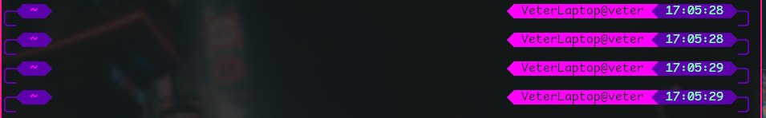

# Преветствую в моем конфиге для zsh

Тут настроено все как мне удобно. Далее будет краткая инструкция по установке, настроке и описанию, что есть что.


Я написал тему, которая позволяет достигнуть нужного мне визуала и легко поменять его, если я захочу. Тема позволяет указать элементы, их положение(справа или слева), а так же текст, цвет текста и фона.

Примеры:



## Установка

### Установка zsh

Arch:

```
sudo pacman -S zsh
```

### Установка oh-my-zsh

Я всегда устанавливаю oh-my-zsh через curl, но на [сайте](https://ohmyz.sh/) есть и другие варианты

```
sh -c "$(curl -fsSL https://raw.githubusercontent.com/ohmyzsh/ohmyzsh/master/tools/install.sh)"
```


### Настрока симлинков

Осторожно, все предыдущие конфиги удаляться!

Для настрокойки всех симлинков(ссылок) надо выполнить скрипт из корневой папки git репозитория(не их ./zsh!!!)

```
bash zsh/create_symlinks.sh
```

Это удалит .zshrc и .oh-my-zsh/custom.
Все ваши распиширения, установленые через oh-my-zsh, будут стерты.

Место этого скрипт создаст симлинки на файлы находящиееся тут, что позволит удобнее за ними следить и обновлять.

## Настрока

Настроки строки zsh можно менять через указание 

```
left_segments
и 
right_segments
```
Лежат в [.oh-my-zsh/themes/purple.zsh-theme](.oh-my-zsh/themes/purple.zsh-theme)

Каждые три элемента массивов задают ожну похицию одного элемента следующим образом:

| Фон | Цвет текста | Текст |
|------------|----------|--------------|
| "0" | "201" | '%~' |

Первый элемент это цвет фона, второй это цвет текста, в третьем это текст, который будет высвечиваться. Текст задается по правилам задачи текста в oh-my-zsh.

Если в тексте указать "", то элемент отображаться не будет

Так же написан плагин, для отображения git репозитория, если он есть в папке.

### PS

Есть сохранение моего p10k, но если пользуетесь этим сами, то лучше настроте свою сами с помощью 
 
```
p10k configure
```
 
Не забудьте скачать расширение на тему.

