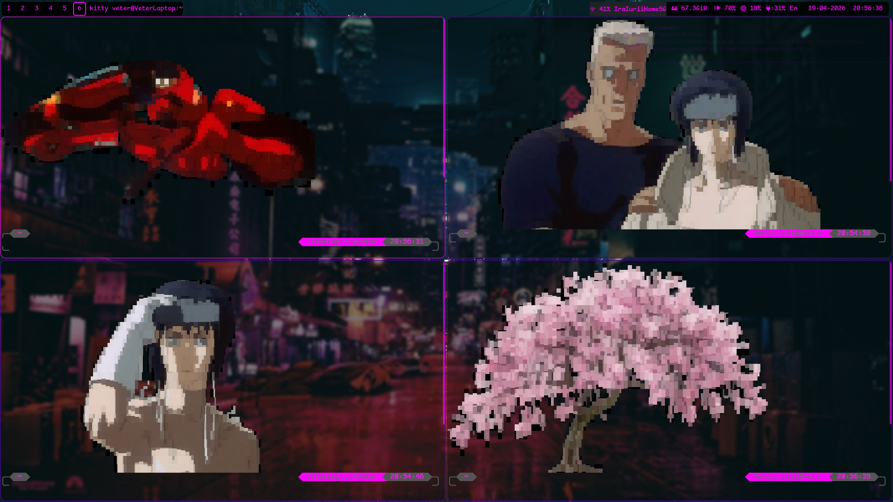

# Приветствую в моём ZSH

## Кратко

Это моя персональная конфигурация для ZSH. Всё настроено для удобной работы в терминале: кастомная тема с гибкой настройкой элементов, интеграция с Git, автоматический вывод случайной картинки при старте и поддержка отдельных тем для нестандартных терминалов (eDEX-UI, cool-retro-term).

Ниже — установка, настройка и повседневное использование моей сборки.

## Идеология

Минимум лишнего, максимум визуального контроля. Тема динамически собирается из блоков, которые можно располагать слева или справа, менять цвета и содержимое. Git-статус всегда под рукой, а каждый запуск терминала встречает новой картинкой — никакой скуки.

Проект полностью основан на [oh-my-zsh](https://ohmyz.sh/) и расширяет его механику, не ломая привычную экосистему.

## Скриншоты




## Установка

Можно запустить быструю установку с помощью
```
cd ~/.myconfig
chmod +x zsh/install.sh
./zsh/install.sh
```
### Установка ZSH

Для Arch Linux и его производных:

```bash
sudo pacman -S zsh chafa
```

`chafa` используется для отображения картинок в терминале.

### Установка oh-my-zsh

Рекомендуемый способ — через curl (другие варианты описаны на [официальном сайте](https://ohmyz.sh/)):

```bash
sh -c "$(curl -fsSL https://raw.githubusercontent.com/ohmyzsh/ohmyzsh/master/tools/install.sh)"
```

> **Примечание:** для работы моей конфигурации `oh-my-zsh` обязателен.

### Настройка симлинков

Скрипт `create_symlinks.sh` удалит ваши существующие файлы `.zshrc` и папку `.oh-my-zsh/custom`, после чего создаст симлинки на файлы из этого репозитория.

Выполните из **корневой папки репозитория** (не из `./zsh/`):

```bash
bash zsh/create_symlinks.sh
```

Всё содержимое `~/.oh-my-zsh/custom` будет заменено. Если вы ставили сторонние плагины — они пропадут.

Симлинки позволят легко обновлять конфигурацию через `git pull`.

## Настройка

Главный файл темы: [`.oh-my-zsh/themes/purple.zsh-theme`](.oh-my-zsh/themes/purple.zsh-theme)

В нём есть два массива:

- `left_segments` — элементы слева от ввода
- `right_segments` — элементы справа

Каждый элемент задаётся массивом из трёх значений:

| Индекс | Значение        | Пример |
|--------|-----------------|--------|
| 0      | Цвет фона       | `"0"`  |
| 1      | Цвет текста     | `"201"`|
| 2      | Текст (prompt-expansion) | `'%~'` |

Цвета указываются в формате 256-цветной палитры (0–255) или в виде имени ANSI.  
Текст поддерживает стандартные подстановки ZSH (например, `%~` — сокращённый путь, `%n` — имя пользователя).

Если в поле `текст` передать пустую строку `""`, элемент не будет отображаться — это удобно для динамического скрытия.

Также в тему встроен **плагин для отображения Git-статуса** (автоматически активируется внутри Git-репозитория).

## Использование

### Картинка при запуске

При каждом открытии терминала Kitty выводится случайное изображение из папки [`./.oh-my-zsh/themes/pic`](./.oh-my-zsh/themes/pic).нений


Из папки [`./.oh-my-zsh/themes/pic/1`](./.oh-my-zsh/themes/pic/1) файлы выволдятся пиксельной графикой.

Из папки [`./.oh-my-zsh/themes/pic/2`](./.oh-my-zsh/themes/pic/2) файлы выводятся без изменений

### Git-информация

Если текущая директория является Git-репозиторием, справа появляется строка статуса:

```
⚠ {изменено} ⇡ {незапушенные коммиты} ! {неотслеживаемые файлы}
```

Символы меняются в зависимости от состояния:

- `⚠` — есть незакоммиченные изменения (modified / deleted)
- `⇡` — количество коммитов, не отправленных в upstream
- `!` — количество untracked файлов

### PS (приглашение ввода)

В моей конфигурации присутствуют заготовки для `powerlevel10k`, однако для полной кастомизации лучше запустить встроенную настройку:

```bash
p10k configure
```

Предварительно установите `powerlevel10k` по [инструкции](https://github.com/romkatv/powerlevel10k#oh-my-zsh).

### Отдельные темы для eDEX-UI и cool-retro-term

Тема автоматически определяет эти терминалы и подстраивает внешний вид (например, убирает лишние элементы, меняет цвета под ретро-стиль).

## Структура файлов

| Файл / папка | Назначение |
|--------------|-------------|
| `.zshrc` (симлинк) | Основной конфиг ZSH, загружает oh-my-zsh и тему |
| `.oh-my-zsh/custom/` (симлинк) | Пользовательские плагины и темы |
| `.oh-my-zsh/themes/purple.zsh-theme` | Моя кастомная тема с сегментами |
| `.oh-my-zsh/themes/pic/` | Коллекция картинок для вывода при старте |
| `create_symlinks.sh` | Скрипт установки симлинков |

## Лицензия

Конфигурация распространяется под лицензией MIT.  
`oh-my-zsh` и его компоненты остаются под собственной лицензией (MIT).

## Благодарности

- [oh-my-zsh](https://ohmyz.sh/) — за мощный фреймворк
- [chafa](https://hpjansson.org/chafa/) — за отличный вывод картинок в терминале
- Kitty, cool-retro-term, eDEX-UI — за вдохновение и необычные эмуляторы